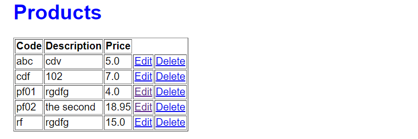
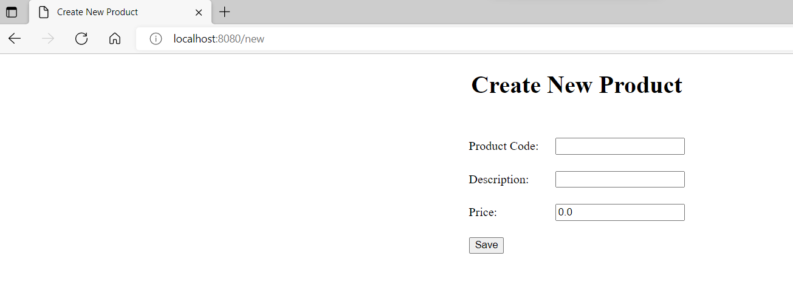
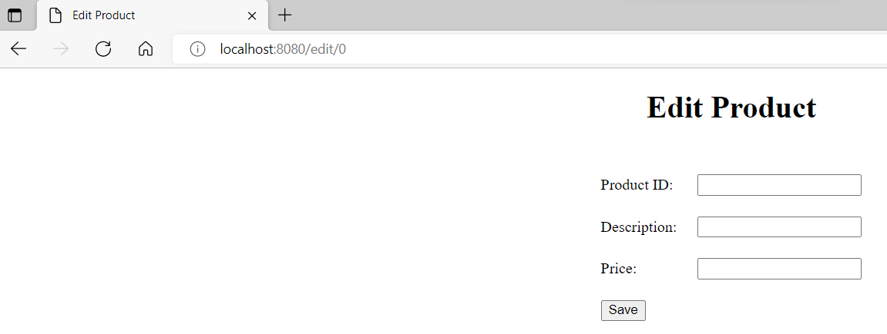

Nhóm 14
Mô hình Spring MVC,Spring data JPA, Thymeleaf

Giới thiệu Cách làm:
Lớp Database để khởi tạo dữ liệu ban đầu
Từ Controller muốn thao tác qua database phải thông qua các class Service. Các class Service sẽ đóng vai trò trung gian và những thứ liên quan đến database sẽ không được sử dụng trực tiếp trong Controller.
Entity Product thể hiện thông tin của table Product trong mysql.
Lớp Repositories:nhận vào một Entity class tương ứng với lớp model Product  , và kiểu dữ liệu của trường ID trong bảng đó. Interface này cung cấp một số function xoay quanh việc CRUD thực thể mà nó quản lí
Lớp Product Service kế thừa từ Repositories thao tác với các hàm trong được định nghĩa sẵn trong JPA
Giao diện sử dụng Thymeleaf để hiển thị sữ liệu truyền từ Controller.

Phân chia công việc:
- Hà Duyên Hùng_B19DCCN293:  thêm sản phẩm

- Lê Huy Hoàng_B19DCCN275: chức năng sửa sản phẩm

- Lê Văn Thằng_B19DCCN658:chức năng xem danh sách, chức năng xóa sản phẩm

